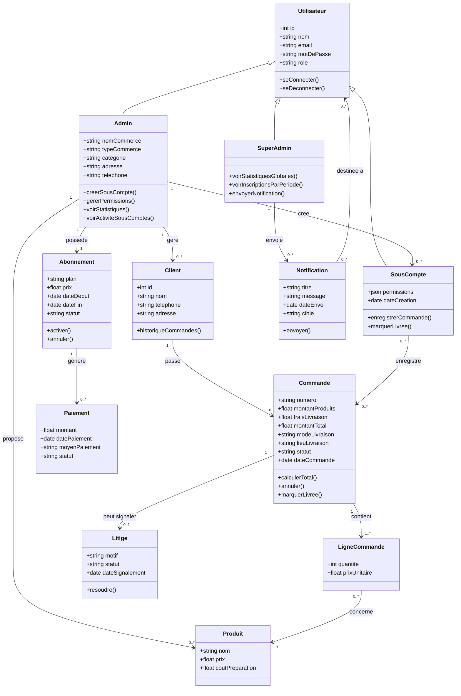

## Modélisation des données

```mermaid
classDiagram
    class Utilisateur {
        +int id
        +string nom
        +string email
        +string motDePasse
        +string role
        +seConnecter()
        +seDeconnecter()
    }
    class SuperAdmin {
        +voirStatistiquesGlobales()
        +voirInscriptionsParPeriode()
        +envoyerNotification()
    }
    class Admin {
        +string nomCommerce
        +string typeCommerce
        +string categorie
        +string adresse
        +string telephone
        +creerSousCompte()
        +gererPermissions()
        +voirStatistiques()
        +voirActiviteSousComptes()
    }
    class SousCompte {
        +json permissions
        +date dateCreation
        +enregistrerCommande()
        +marquerLivree()
    }
    class Client {
        +int id
        +string nom
        +string telephone
        +string adresse
        +historiqueCommandes()
    }
    class Commande {
        +string numero
        +float montantProduits
        +float fraisLivraison
        +float montantTotal
        +string modeLivraison
        +string lieuLivraison
        +string statut
        +date dateCommande
        +calculerTotal()
        +annuler()
        +marquerLivree()
    }
    class LigneCommande {
        +int quantite
        +float prixUnitaire
    }
    class Produit {
        +string nom
        +float prix
        +float coutPreparation
    }
    class Litige {
        +string motif
        +string statut
        +date dateSignalement
        +resoudre()
    }
    class Abonnement {
        +string plan
        +float prix
        +date dateDebut
        +date dateFin
        +string statut
        +activer()
        +annuler()
    }
    class Paiement {
        +float montant
        +date datePaiement
        +string moyenPaiement
        +string statut
    }
    class Notification {
        +string titre
        +string message
        +date dateEnvoi
        +string cible
        +envoyer()
    }

    Utilisateur <|-- SuperAdmin
    Utilisateur <|-- Admin
    Utilisateur <|-- SousCompte
    Admin "1" --> "0..*" SousCompte : cree
    Admin "1" --> "0..*" Client : gere
    Admin "1" --> "0..*" Produit : propose
    Client "1" --> "0..*" Commande : passe
    Commande "1" --> "1..*" LigneCommande : contient
    LigneCommande "0..*" --> "1" Produit : concerne
    Commande "1" --> "0..1" Litige : peut signaler
    SousCompte "0..*" --> "0..*" Commande : enregistre
    Admin "1" --> "1" Abonnement : possede
    Abonnement "1" --> "0..*" Paiement : genere
    SuperAdmin "1" --> "0..*" Notification : envoie
    Notification "0..*" --> "0..*" Utilisateur : destinee a
```